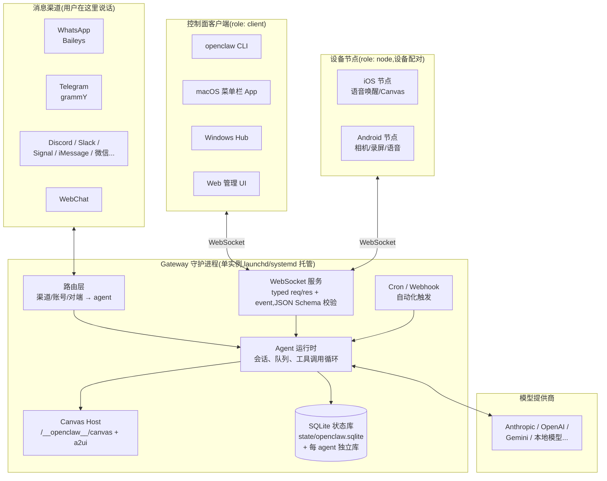
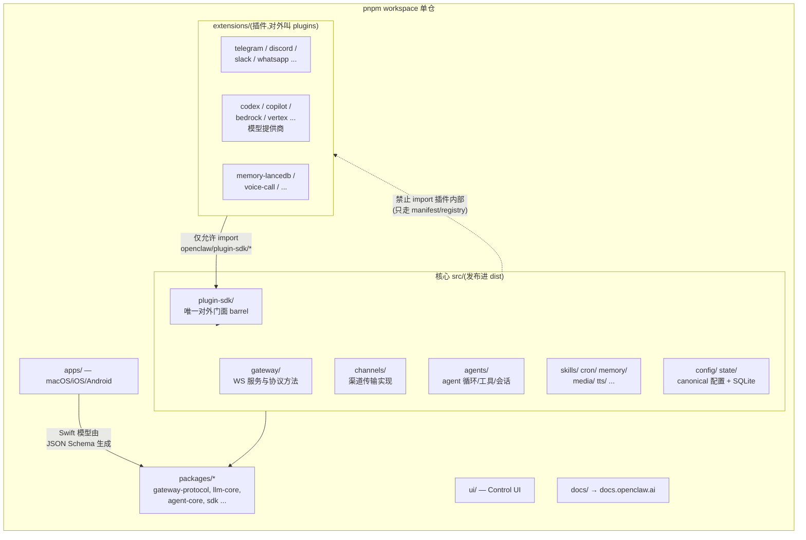
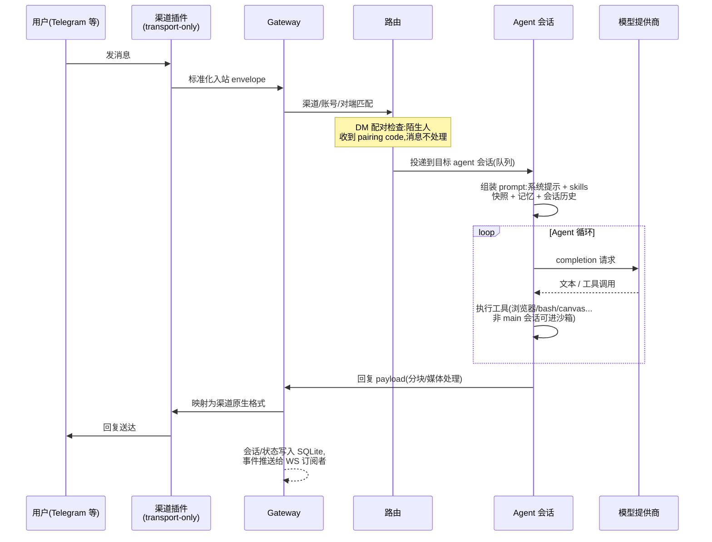

# OpenClaw 整体架构设计

> 本文是对 OpenClaw 代码库的架构梳理笔记(基于 2026.6.2 版本源码与 `docs/concepts/architecture.md`、根 `AGENTS.md`),
> 从三个视角描述系统:运行时拓扑、代码分层、消息流转。

## 1. 运行时拓扑:单 Gateway 控制平面

整个系统的核心是一个**单实例、长驻的 Gateway 守护进程**(每台主机一个,默认绑定 `127.0.0.1:18789`,
由 launchd/systemd 托管)。它是唯一的控制平面:所有消息渠道连接、所有控制面客户端、所有设备节点都汇聚到这里。

### 协议关键不变量

- 每台主机只有一个 Gateway,它是唯一打开 WhatsApp(Baileys)会话的进程。
- WebSocket 握手第一帧必须是 `connect`,否则硬关闭连接。
- 所有客户端(操作端 + 节点)在 `connect` 时携带设备身份,新设备需配对审批
  (签名 challenge nonce + 签发设备 token);本机回环连接可自动批准,非本地连接必须显式审批。
- 副作用方法(`send`、`agent`)要求幂等键,服务端维护短期去重缓存。
- 事件不重放;客户端检测到序号断档后需主动刷新快照。

## 2. 代码分层:核心与插件的边界

这是根 `AGENTS.md` 中最强调的设计约束:**core 保持 plugin-agnostic**,
插件只能通过 `openclaw/plugin-sdk/*` 公开门面进入核心,禁止反向或越界 import。

### 边界规则(核心设计哲学)

- **插件 → 核心**:只能走 `openclaw/plugin-sdk/*`、manifest 元数据、注入的 runtime helper、
  文档化的 barrel(`api.ts`、`runtime-api.ts`);禁止 import 核心 `src/**` 或其他插件内部。
- **核心 → 插件**:核心代码中不允许出现任何具体插件的 id/默认值/策略,
  只通过 manifest/registry/capability 这类通用契约发现插件。
- **渠道是纯传输层**:只负责渲染可移植的 presentation/action、执行传输限制、映射原生回调封套;
  产品命令树、provider 策略、功能菜单归核心/owner 插件所有。
- **提供商插件**拥有自己的 auth/catalog/runtime hooks;核心只拥有通用 agent 循环。
- **状态只进 SQLite**(Kysely 访问,禁止裸 SQL 字符串,DDL/迁移除外):
  全局状态在 `state/openclaw.sqlite`,agent 级状态在 `agents/<agentId>/agent/openclaw-agent.sqlite`。
  旧文件格式只在 `openclaw doctor --fix` 迁移代码中处理,运行时无兼容分支、无 fallback 读取。
- **配置只有 canonical 形态**:运行时只读当前配置形态;旧配置由 doctor 迁移,不做静默兼容。
- **协议链**:TypeBox schema → 生成 JSON Schema → 生成 Swift 模型;
  协议变更必须先做加法兼容,不兼容变更需要版本化 + 文档 + 客户端跟进。

## 3. 一条消息的生命周期

### 安全模型要点

- 入站 DM 默认视为**不可信输入**:主流渠道默认 `dmPolicy="pairing"`,
  陌生发送者只收到配对码,消息不进 agent;公开 DM 需要显式 `dmPolicy="open"` + 通配 allowlist。
- `main` 会话默认在宿主机直接执行工具(单用户场景);群组/多人场景可配
  `agents.defaults.sandbox.mode: "non-main"`,非 main 会话进 Docker/SSH/OpenShell 沙箱,
  并按工具族 allow/deny。
- 第三方 skill 视为不可信代码:安装走 ClawHub 信任信封 + 安全扫描,
  可配 `security.installPolicy` 本地策略命令,失败即拒绝(fail-closed)。

## 一句话总结

OpenClaw = **"一个本地 Gateway 进程 + 插件化的渠道/提供商生态 + 通用 agent 循环"**。
所有外部世界(聊天软件、设备、模型 API)都被插件适配成统一契约,
核心只做路由、会话、工具循环和状态管理;
客户端和设备节点统一走带配对认证的 WebSocket 协议接入。

完整官方文档:<https://docs.openclaw.ai/concepts/architecture>
