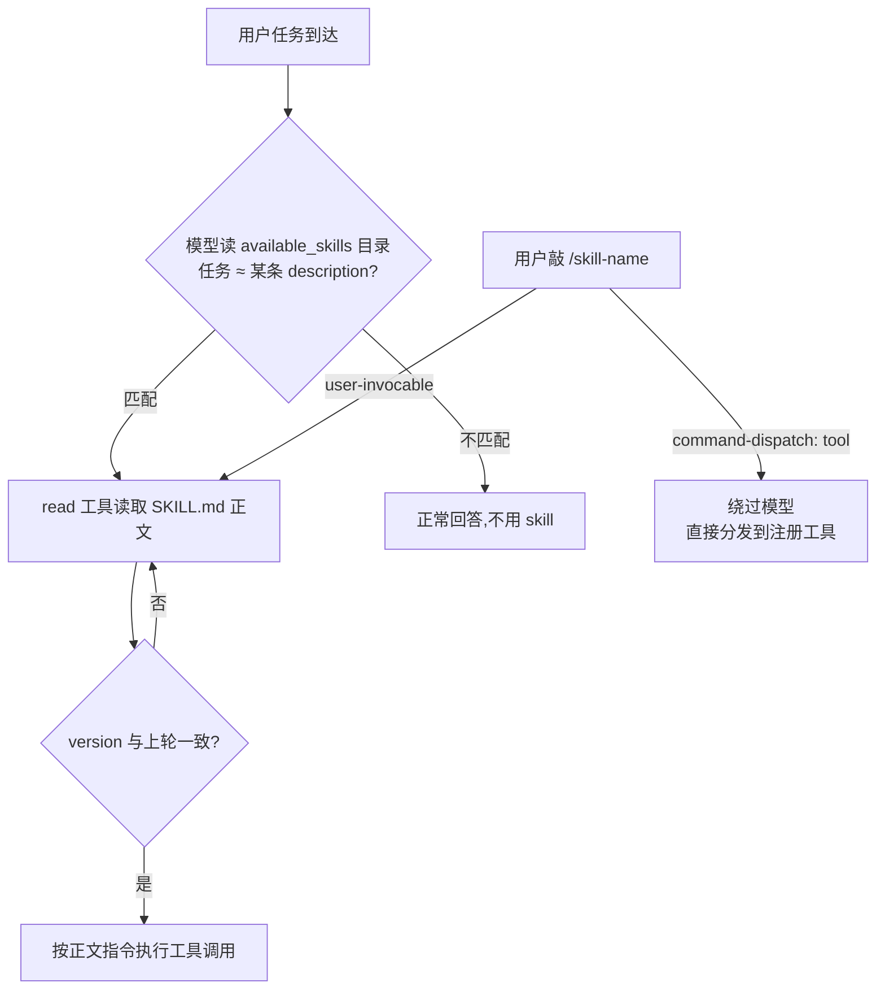

# OpenClaw Skill 触发机制:agent 如何判断是否使用、使用哪个 skill

> 本文是对 OpenClaw skill 调用决策机制的源码分析笔记(基于 2026.6.2 版本),
> 关键源码:`src/skills/loading/skill-contract.ts`(`formatSkillsForPrompt`)、
> `src/skills/loading/workspace.ts`(`formatSkillsCompact` / `applySkillsPromptLimits`)。
> 配套文档:[skills-management-design.md](./skills-management-design.md)。

## 核心结论

**OpenClaw 不做任何代码层面的"技能匹配/检索"——没有 embedding、没有关键词索引、没有路由算法。
选择哪个 skill 完全交给模型自己语义判断**,采用渐进式披露(progressive disclosure)设计:
prompt 里只放每个技能的元数据目录,正文由模型按需用 `read` 工具加载。

## 两层决策

### 第一层:代码决定"哪些可用"

加载管线(见 skill 管理设计笔记)先把不合格的技能筛掉:

- 门控不满足(缺二进制 `requires.bins`、缺环境变量 `requires.env`、缺配置 `requires.config`、平台不符 `os`)
- agent allowlist 之外(`agents.list[].skills`)
- `enabled: false` 或 `disable-model-invocation: true`

活下来的技能只把**元数据**序列化进系统提示——不含正文:

```xml
The following skills provide specialized instructions for specific tasks.
Use the read tool to load a skill's file when the task matches its description.
If a skill's <version> differs from a previous turn, re-read its SKILL.md before using it.

<available_skills>
  <skill>
    <name>github</name>
    <description>Interact with GitHub via gh CLI...</description>
    <location>/path/to/skills/github/SKILL.md</location>
    <version>3</version>
  </skill>
  ...
</available_skills>
```

### 第二层:模型决定"用不用、用哪个"

prompt 里那句指令就是全部机制——
*"当任务与某个 skill 的 description 匹配时,用 read 工具加载它的文件"*。即:

1. 模型拿用户任务和目录里的 `description` 做语义比对(纯 LLM 推理);
2. 认为匹配 → 调 `read` 工具读取 `<location>` 指向的 `SKILL.md` 全文;
3. 按读到的指令行事(正文里通常写"遇到 X 情况用 Y 工具/命令")。

**推论:`description` 写得好不好直接决定技能会不会被触发** ——
它是 skill 作者手里最重要的"路由表项"。

## 决策流程图



## 三个细节设计

### 1. 预算降级(`applySkillsPromptLimits`)

技能太多时按梯度退化,尽量保住"模型知道技能存在"这件事:

| 梯度 | 行为 | 代价 |
| --- | --- | --- |
| 正常 | name + description + location + version | 无 |
| 超出 `maxSkillsInPrompt` | 截断技能数量 | 后面的技能不可见 |
| 超字符预算 | 降级 compact 格式:只有 name + location | 丢 description,模型只能按名字匹配 |
| 仍超 | 截断 + 注入警告 | `⚠️ Skills truncated... Run openclaw skills check` |

### 2. 版本失效信号

目录里带 `<version>`,prompt 指令要求
"若 version 与上一轮不同,使用前必须重读 SKILL.md"。
这是会话内技能内容更新的缓存失效机制——
技能集快照(SkillSnapshot)本身在会话内固定,但正文变更可以通过版本号传导。

### 3. 绕过模型的路径

| frontmatter 配置 | 效果 |
| --- | --- |
| `disable-model-invocation: true` | 不进 `<available_skills>`,模型永远不会自主使用;仅用户可通过 `/skill-name` 触发 |
| `command-dispatch: tool` | 斜杠命令连模型都不经过,确定性分发到注册工具(`SkillCommandDispatchSpec`,`argMode: raw` 原样转发参数) |
| `metadata.openclaw.always: true` | 反向操作:跳过 requirements 门控,无条件进目录 |

## 设计渊源

这与 Anthropic 官方 Agent Skills 的设计同构:
目录条目只占几十 token/技能,正文按需加载;
**"路由智能"留给模型,"可用性控制"留给代码**。
好处是零检索基础设施、技能数量可扩展(token 成本近似常数),
代价是触发可靠性依赖模型能力与 description 质量。
