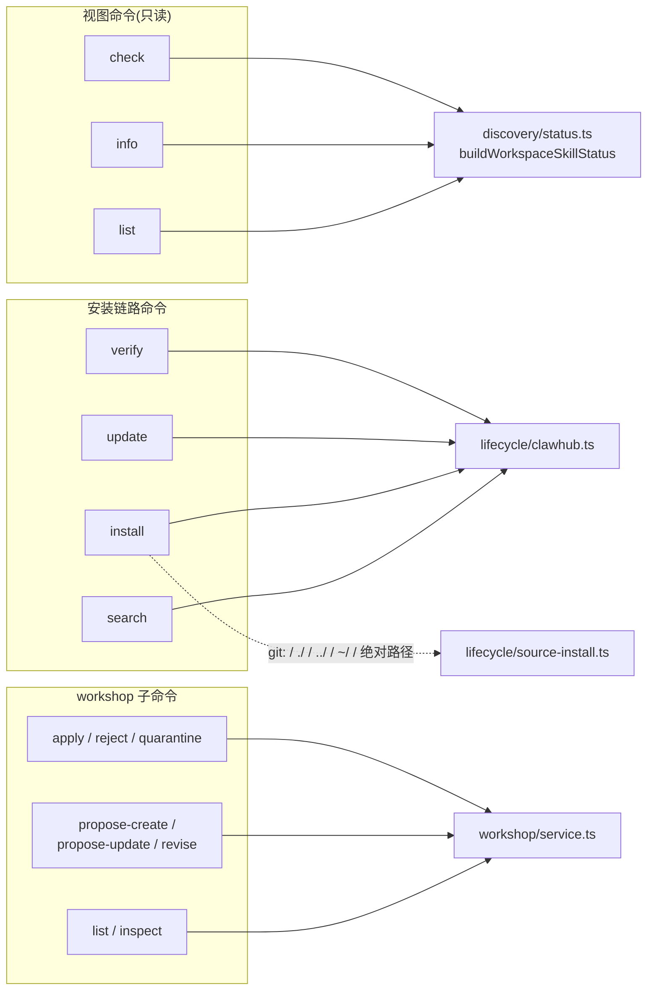
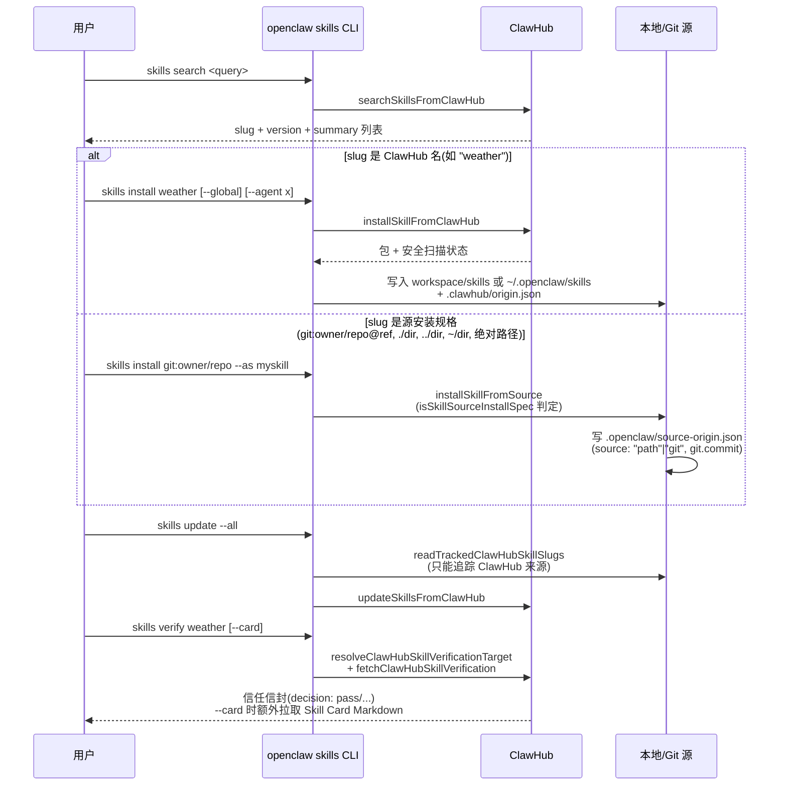

# OpenClaw Skill CLI 与真实样例

> 本文是对 `openclaw skills` 命令族与内置 skill 实例的梳理笔记(基于 2026.6.2 版本源码
> `src/cli/skills-cli.ts`、`src/cli/skills-cli.format.ts`、仓库 `skills/`(58 个内置技能)、
> `docs/tools/creating-skills.md`)。
> 配套文档:[skills-management-design.md](./skills-management-design.md)(加载/安装/Workshop 设计)、
> [skill-invocation-mechanism.md](./skill-invocation-mechanism.md)(模型如何选用 skill)。

## 1. 命令总览

`openclaw skills` 下的子命令按职责分三组,分别落到 `src/skills/` 的三个子模块:



不带子命令时(`openclaw skills`)等价于 `skills list`(`skills-cli.ts:857`)。
所有命令都接受 `--agent <id>`,解析顺序是:显式 `--agent` > 按 cwd 反推 workspace 所属 agent
> 配置里的默认 agent(`resolveSkillsWorkspace`,`skills-cli.ts:71-88`)。

## 2. 三个视图命令:list / info / check

三者共享同一份数据源 `SkillStatusEntry[]`(`discovery/status.ts`),区别只是渲染粒度:

| 命令 | 输出 | 用途 |
| --- | --- | --- |
| `skills list [--eligible] [-v]` | 表格:Status / Skill / Description / Source(`-v` 加 Missing 列) | 浏览所有发现到的技能,`--eligible` 只看可用的 |
| `skills info <name>` | 单个技能的详情:requirements 逐项 ✓/✗、install 选项、API key 设置提示 | 排查某个技能为什么不可用,或它需要什么 env/二进制 |
| `skills check` | 汇总计数 + 分类清单 | 一眼看出"模型能看到几个技能、有几个被挡住" |

### 状态字段含义(`SkillStatusEntry`,决定 list/check 的分类)

`formatSkillStatus`(`skills-cli.format.ts:42-56`)按优先级判定单个技能状态,
`check` 命令(`skills-cli.format.ts:338-492`)按同一组字段做汇总:

| 字段 | 含义 | 对应 [skill-invocation-mechanism.md](./skill-invocation-mechanism.md) 中的概念 |
| --- | --- | --- |
| `disabled` | frontmatter `enabled: false` | 第一层门控,直接不进任何输出 |
| `blockedByAllowlist` | 未通过 `requires.*` 门控 | 第一层门控(缺二进制/env/config/os) |
| `blockedByAgentFilter` | 不在该 agent 的 `agents.list[].skills` 内 | 第一层门控的 allowlist 分支 |
| `eligible` | 安装齐全、requirements 满足 | 是否"活下来"进入候选集 |
| `modelVisible` | 进 `<available_skills>` 目录 | 第二层:模型能看到的范围(`disable-model-invocation` 为 false 才会是 true) |
| `commandVisible` | 注册为 `/skill-name` 斜杠命令 | `user-invocable` 是否为真 |
| `missing.{bins,anyBins,env,config,os}` | 具体缺什么 | `info` 命令逐项渲染 ✓/✗ 的依据 |

`check` 的 `notInjected`(代码里叫 `promptHidden`)专门标出
"**已就绪但不在模型 prompt 里**"的技能——即 `eligible && !blockedByAgentFilter && !modelVisible`,
对应 `disable-model-invocation: true` 的技能:它们仍可通过 `/skill-name`、cron 或工具分发使用。

## 3. 安装链路:search / install / update / verify



关键细节(`skills-cli.ts`):

- **来源判定是字符串前缀规则**(`isSkillSourceInstallSpec`,`source-install.ts:391-400`):
  `git:` 前缀、`./`、`../`、`~/`、绝对路径 → 走源安装;否则视为 ClawHub slug。
  `--version` 只对 ClawHub 安装有效,`--as` 只对源安装有效,两者混用会报错(`skills-cli.ts:316-348`)。
- **`--global` vs `--agent`**:`--global` 写入共享的 `~/.openclaw/skills`(`CONFIG_DIR`),
  `--agent` 写入该 agent 的 workspace `skills/`;两者互斥(`resolveClawHubTargetWorkspaceDir`,`skills-cli.ts:129-143`)。
- **`update --all` 只能更新 ClawHub 来源的技能**——源安装(git/本地)不写 `.clawhub/origin.json`,
  因此 `readTrackedClawHubSkillSlugs` 看不到它们,`--all` 时这类技能会被静默跳过。
- **`verify`** 不依赖本地文件内容,而是把 `.clawhub/origin.json` 记录的 `slug@version` 发给 ClawHub
  做信任信封校验;`shouldFailSkillVerification` 只看响应里的 `ok` 与 `decision === "pass"`,
  失败时 CLI 以非零退出码结束,适合接入 CI/`openclaw skills check` 之外的供应链门禁。

## 4. workshop 子命令:提案生命周期的 CLI 入口

[skills-management-design.md](./skills-management-design.md#4-skill-workshopagent-自我演化的审批闸门)
中的提案流程在 CLI 上的映射(均落到 `workshop/service.ts`):

| CLI | service.ts 函数 | 作用 |
| --- | --- | --- |
| `workshop list [--json]` | `listSkillProposals` | 列出 pending/completed 提案(id, status, kind, skillKey, title) |
| `workshop inspect <id>` | `inspectSkillProposal` | 看提案正文 + 附带的 support files + 扫描状态(`record.scan.state`) |
| `workshop propose-create --name --description` | `proposeCreateSkill` | 为**新**技能创建提案(`createdBy: "cli"`) |
| `workshop propose-update <skill>` | `proposeUpdateSkill` | 为**已存在**技能创建更新提案 |
| `workshop revise <id>` | `reviseSkillProposal` | 替换 pending 提案的正文/描述/目标(产生新 `proposedVersion`) |
| `workshop apply <id>` | `applySkillProposal` | 人工批准后落盘到真实 `SKILL.md`(`workspace-skill-write`) |
| `workshop reject <id>` / `quarantine <id>` | `rejectSkillProposal` / `quarantineSkillProposal` | 拒绝或隔离(带 `--reason`) |

提案正文来源统一是 `--proposal <path>`(单文件)或 `--proposal-dir <path>`
(含 `PROPOSAL.md` + UTF-8 support files 的目录),二者互斥、必选其一
(`readSkillProposalInput`,`skills-cli.ts:221-237`)。这一层 CLI 本身不做内容审查——
`record.scan.state` 来自 `security/scanner.ts` 的安装前扫描,`apply` 时才真正写入活动技能目录。

## 5. SKILL.md frontmatter 实例图谱

仓库 `skills/`(58 个内置技能)展示了 frontmatter 字段的几种典型组合,
从最简到最完整:

### 5.1 最简形态:只有 `name` + `description`

`skills/skill-creator/SKILL.md:1-4`——本身就是"如何写 skill"的元技能,刻意保持最小:

```yaml
---
name: skill-creator
description: "Create, edit, audit, tidy, validate, or restructure AgentSkills and SKILL.md files."
---
```

### 5.2 声明式门控 + 安装引导:`requires` + `install`

`skills/blucli/SKILL.md:1-20`——缺 `blu` 二进制时,`info`/`list -v` 会展示这条安装选项:

```yaml
---
name: blucli
description: "BluOS CLI (blu) for discovery, playback, grouping, and volume."
homepage: https://blucli.sh
metadata:
  {
    "openclaw":
      {
        "emoji": "🫐",
        "requires": { "bins": ["blu"] },
        "install": [{ "id": "go", "kind": "go", "module": "github.com/steipete/blucli/cmd/blu@latest",
                       "bins": ["blu"], "label": "Install blucli (go)" }],
      },
  }
---
```

`skills/session-logs/SKILL.md` 是多二进制版本(`requires.bins: ["jq", "rg"]`,两条 brew 安装选项)。

### 5.3 斜杠命令 + API key 提示:`user-invocable` + `primaryEnv`

`skills/gh-issues/SKILL.md:1-22`——`user-invocable: true` 让它出现在 `commandVisible` 里,
`primaryEnv` 让 `skills info gh-issues` 在 `GH_TOKEN` 缺失时打印"API key setup"区块:

```yaml
---
name: gh-issues
description: "Fetch GitHub issues, select candidates, spawn background fix agents, open PRs, ..."
user-invocable: true
metadata:
  {
    "openclaw":
      {
        "requires": { "bins": ["git", "gh"] },
        "primaryEnv": "GH_TOKEN",
        "install": [{ "id": "brew", "kind": "brew", "formula": "gh", "bins": ["gh"],
                       "label": "Install GitHub CLI (brew)" }],
      },
  }
---
```

### 5.4 绕过模型的字段(仓库内置技能暂无样例,引自 `docs/tools/creating-skills.md:106-113`)

这三个字段决定[skill-invocation-mechanism.md](./skill-invocation-mechanism.md#3-绕过模型的路径)
里"绕过模型"的具体写法:

| 字段 | 默认值 | 效果 |
| --- | --- | --- |
| `disable-model-invocation` | `false` | `true` 时 `modelVisible=false`(不进 `<available_skills>`),但仍可 `/skill` 调用 |
| `command-dispatch` | — | 设为 `tool` 时,斜杠命令直接路由到工具,绕过模型 |
| `command-tool` | — | `command-dispatch: tool` 时要调用的工具名 |
| `command-arg-mode` | `raw` | 工具分发模式下,把斜杠命令的参数原文转发给该工具 |

## 6. 命令 → 源码速查表

| 命令 | 入口函数(`skills-cli.ts`) | 核心实现 |
| --- | --- | --- |
| `skills list/info/check` | `runSkillsAction` + `format*` | `discovery/status.ts: buildWorkspaceSkillStatus` |
| `skills search` | `searchSkillsFromClawHub` | `lifecycle/clawhub.ts` |
| `skills install` | 分支:`installSkillFromClawHub` / `installSkillFromSource` | `lifecycle/clawhub.ts` / `lifecycle/source-install.ts` |
| `skills update` | `updateSkillsFromClawHub` + `readTrackedClawHubSkillSlugs` | `lifecycle/clawhub.ts` |
| `skills verify` | `resolveClawHubSkillVerificationTarget` + `fetchClawHubSkillVerification` | `infra/clawhub.ts` |
| `skills workshop *` | 见第 4 节表格 | `workshop/service.ts` |

## 一句话总结

`openclaw skills` CLI 是 [skills-management-design.md](./skills-management-design.md)
里那套加载/安装/Workshop 设计的**操作面**:`list/info/check` 直接复用 agent prompt 用的同一份
`SkillStatusEntry`,所以 CLI 看到的"ready/visible/blocked"状态与模型 prompt 里
`<available_skills>` 的内容是同一份真相;`install/update/verify` 覆盖 ClawHub 与
git/本地源两条安装路径,但只有 ClawHub 路径可追踪更新;`workshop` 子命令把
"agent 提案 → 人工审批 → 落盘"的每一步都暴露成独立命令,方便脚本化审核。

完整官方文档:<https://docs.openclaw.ai/cli/skills>(命令参考)、
<https://docs.openclaw.ai/tools/creating-skills>(frontmatter 字段参考)
