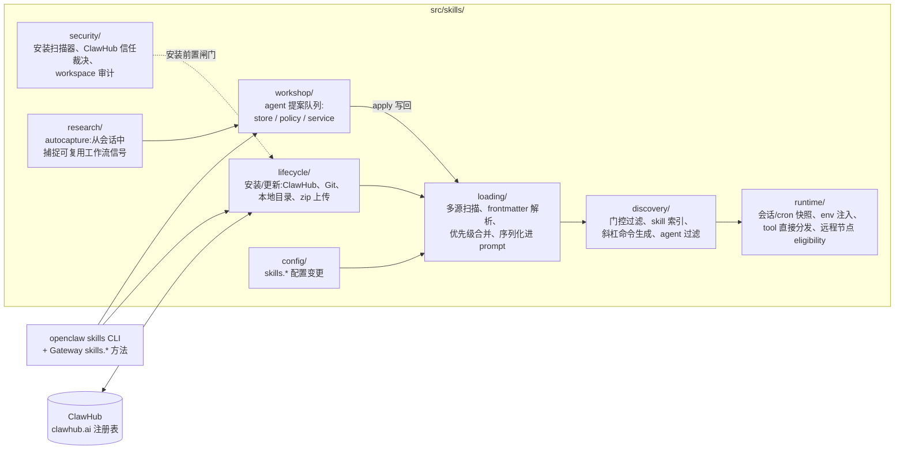
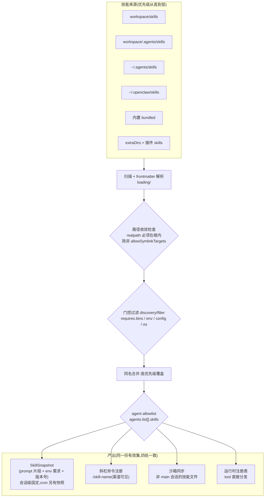
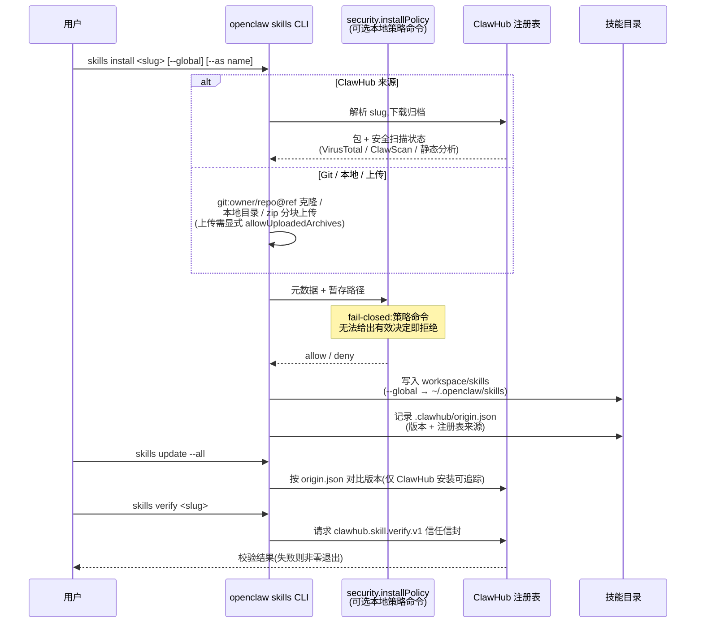
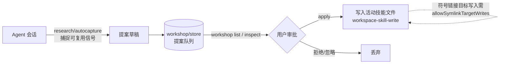

# OpenClaw Skill 管理整体设计

> 本文是对 OpenClaw skill(技能)系统的设计梳理笔记(基于 2026.6.2 版本源码 `src/skills/`、
> `docs/tools/skills.md` 与根 `AGENTS.md`)。
> Skill 是教 agent "如何及何时使用工具"的 markdown 指令单元,遵循 [AgentSkills](https://agentskills.io) 规范。

## 0. 基本单元:SKILL.md

每个 skill 是一个目录,核心是带 YAML frontmatter 的 `SKILL.md`:

```markdown
---
name: image-lab
description: Generate or edit images via a provider-backed image workflow
metadata: {"openclaw": {"requires": {"bins": ["ffmpeg"]}, "emoji": "🎨"}}
user-invocable: true
---

When the user asks to generate an image, use the `image_generate` tool...
```

关键契约(见 `src/skills/types.ts`):

- `name` / `description` 必填;name 决定技能名、斜杠命令名、allowlist 键(缺省取目录名)。
- `metadata.openclaw.requires`:门控声明 —— `bins` / `anyBins`(命令行二进制)、`env`(环境变量)、
  `config`(配置项)、`os`(平台),不满足则该 skill 不进 prompt。
- `metadata.openclaw.install`:声明式安装规格(`brew | node | go | uv | download`),
  缺二进制时引导安装。
- 调用策略:`user-invocable`(暴露为斜杠命令)、`disable-model-invocation`(不进模型 prompt)、
  `command-dispatch: tool`(斜杠命令绕过模型直接分发到注册工具)。
- frontmatter 解析器只支持**单行键**,`metadata` 必须是单行 JSON;正文可用 `{baseDir}` 引用技能目录。

## 1. 模块地图(src/skills/)



## 2. 加载管线:从磁盘到 agent prompt

技能从六类来源加载,**同名时高优先级覆盖低优先级**;
任何根目录下出现 `SKILL.md` 即被发现(子目录层级仅作组织用)。

| 优先级 | 来源 | 路径 | 可见范围 |
| --- | --- | --- | --- |
| 1(最高) | Workspace skills | `<workspace>/skills` | 仅该 agent |
| 2 | 项目 agent skills | `<workspace>/.agents/skills` | 仅该工作区 agent |
| 3 | 个人 agent skills | `~/.agents/skills` | 本机所有 agent |
| 4 | 托管/本地 skills | `~/.openclaw/skills` | 本机所有 agent |
| 5 | 内置 skills | 随安装包发布(仓库 `skills/`,约 50 个) | 本机所有 agent |
| 6(最低) | 额外目录 + 插件 skills | `skills.load.extraDirs`、插件 manifest 的 `skills` 字段 | 本机所有 agent |



设计要点:

- **位置与可见性分离**:目录优先级只决定"谁覆盖谁";agent 能看到什么由 allowlist 决定
  (`agents.defaults.skills` 为共享基线,`agents.list[].skills` 非空时**整体替换**而非合并,
  `[]` 表示零技能,省略则不限制)。
- **快照(snapshot)语义**:会话开始时固化一份 `SkillSnapshot`(prompt 文本 + 所需 env + 版本号),
  会话中途技能变更不影响进行中的会话;cron 任务有独立的快照路径(`runtime/cron-snapshot.ts`)。
  这与 AGENTS.md "hot path 不做 freshness 轮询" 的原则一致 —— 技能集是进程稳定元数据,
  变更走显式 refresh(`runtime/refresh.ts`)。
- **远程节点 eligibility**(`runtime/remote.ts`):门控检查可以基于远程执行环境的平台/二进制集合,
  而不是 Gateway 宿主机本身。

## 3. 安装生命周期:ClawHub 与多源安装



安全模型(skill 被明确视为**不可信代码**):

- **信任信封**:`openclaw skills verify` 对照 `.clawhub/origin.json` 记录的版本与注册表做校验;
  ClawHub 页面在安装前即暴露最新扫描状态。
- **操作员安装策略**:`security.installPolicy` 配一个本地策略命令,
  覆盖 ClawHub/上传/Git/本地/更新/依赖安装全部路径,fail-closed。
- **路径收敛**:workspace/项目/extraDirs 的 skill 根必须 realpath 收敛在配置根内
  (防符号链接逃逸),例外需 `skills.load.allowSymlinkTargets` 显式信任。
- **密钥注入范围**:`skills.entries.*.env` / `.apiKey` 只注入**宿主进程的当轮 agent 调用**,
  不进沙箱、不进 prompt。

## 4. Skill Workshop:agent 自我演化的审批闸门

agent 在工作中发现可复用的流程时,**不直接写 SKILL.md**,而是产出提案进队列,人工审批后才落盘:



这是整个系统"agent 可以建议、人类拥有最终所有权"原则的具体化:
`workshop/policy.ts` 定义什么可以被提案,`service.ts` 管理生命周期,
CLI 入口为 `openclaw skills workshop list / inspect <id> / apply <id>`。

## 5. 与插件系统的关系

- 插件通过 `openclaw.plugin.json` 的 `skills` 字段携带技能目录,随插件启用而加载,
  合并在最低优先级层(与 `extraDirs` 同级)—— 任何同名的内置/托管/agent/workspace 技能都能覆盖它。
- 插件技能可用 `metadata.openclaw.requires.config` 绑定到插件自己的配置项做门控。
- 核心通过 `plugin-sdk/skills-runtime` barrel 向插件暴露技能运行时能力,
  符合"插件只走 SDK 门面"的总边界。

## 一句话总结

Skill 系统 = **"markdown 即能力 + 多源覆盖加载 + 声明式门控 + 快照固化 + 不可信供应链治理 + 人审进化"**:
能力以纯文本契约描述,从六层来源按优先级合并,按环境声明过滤,
会话内固化为快照保证确定性;安装链路全程有信任校验与策略闸门,
而 agent 对技能库的修改永远经过 Workshop 人工审批。

完整官方文档:<https://docs.openclaw.ai/tools/skills>
